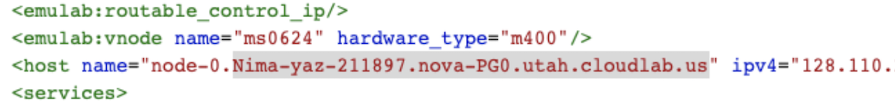
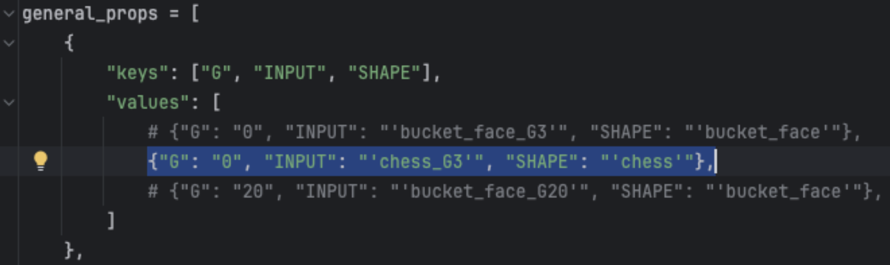
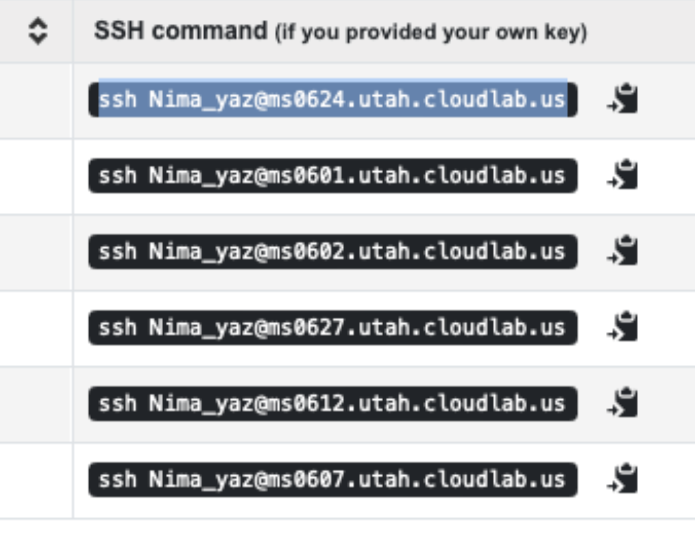

# Flying Light Specks As Processes

This repository contains a basic skeleton of software that launches FLSs at processes.

Authors:  Hamed Alimohammadzadeh(halimoha@usc.edu), Shuqin Zhu (shuqinzh@usc.edu), Nima Yazdani (nimayazd@usc.edu), and Shahram Ghandeharizadeh (shahram@usc.edu)

# Clone
`git clone https://github.com/flyinglightspeck/FLSsAsProcesses`

## Set Up Local
Run `bash setup.sh` to set up everything.

If anything went wrong with the bash command, simply run `pip3 install -r requirements.txt` in the root directory. If you are using IDE like PyCharm, you can download all the requirements with it.
We recommend the use of PyCharm for running this software on a single laptop or server for evaluation purposes.
By installing and using PyCharm, the single server version of software will execute on a wide range of operating systems ranging from macOS to Windows.  

## Run Local

Adjust the following variables specified in `config.py`:

`DURATION`: the number of seconds the experiment will run for.

`INPUT`: specify the name of the input xlsx file that describes the animation. Options for inputs are specified in the assets/pointcloud directory.

`SHAPE`: the class of shape taken as the input for the animation. This is set based on the xlsx file you choose as your input. For example the chess_G3.xlsx file should have the shape “chess”.

`RESULTS_PATH`: set to ‘results’ to store the results locally

Run `python3 primary.py`

After the notification "INFO - Waiting for secondary nodes to connect" shows, run:

Run `python3 secondary.py`

Something similar to the following message should then be displayed:

INFO - Read Group \
INFO - Starting 1 secondary nodes \
INFO - Initializing 1 dispatchers\
INFO - Assigning FLSs to dispatchers\
INFO - Assigned 5 FLSs to dispatchers\
INFO - Starting 1 dispatchers\
INFO - Stopping dispatchers\
INFO - Stopping the experiment, experiment time=3.0145070552825928\
INFO - Stopping secondary nodes\
INFO - Time for All process stop=0.2271280288696289\
INFO - Writing results

## Set Up and Run on Cloud Lab
First, set up a cluster of servers. Creat a cloudlab profile using the file `profile.py`, then start your own experiments with any chosen type of nodes. 
Ideally, the total number of cores of the servers should equal or be greater than the number of points in the point cloud (number of FLSs).
Otherwise, the lack of cores may cause incorrect results. Normally, when the accessible resource is limited, one core for 2 to 4 points will also work. 
 
1. Log into CloudLab
2. At the top left select Experiments
3. Click Start Experiment
4. Select a Profile. Use the profile provided by profile.py
5. Next page: Define the hardware spec of nodes to use. Look to the Manual linked on the page for more information.
6. Define the Number of Nodes desired
7. Next page: You may optionally name the experiment.
8. On the final page: Define the start time and duration of the experiment. If you want to immediately begin the experiment do not define a start date or time.

After setting up cloudlab, modify the following files based on comment:

Once the experiment is running in Cloudlab, go to `cloudlab_vars.sh`
Edit the `HOSTNAME` and `USERNAME` to reflect your experiment settings and Cloudlab account.
The hostname can be found by going to the manifest tab on Cloud Lab and copying the hostname defined there. Copy everything after node-0. For example `Nima-yaz-211897.nova-PG0.utah.cloudlab.us`

Edit `REPO_NAME` to be the name of your cloned repository. \
Set the `num_of_total_servers` equal to the number of nodes initialized in Cloudlab.

Edit the `GITHUB_TOKEN` and `GITHUB_REPO` variables in `decentralized_gen.sh`.
See [Github Personal Token Tutorial](https://docs.github.com/en/authentication/keeping-your-account-and-data-secure/managing-your-personal-access-tokens) to update the `GITHUB_TOKEN`.

Setup Nodes for the first time: \
Run `./decentralized_gen.sh --copy-key`. \
Run `./decentralized_gen.sh --setup`. This should only be run the first time the nodes are initialized. If it says that you do not have permission to execute this then run `chmod +x decentralized_gen.sh`.

When editing the code, commit and push your changes to your repo and then run `./decentralized_gen.sh --update`.

Navigate to `constants.py` and set `RUNNING_ON_CLOUDLAB` to True. \
Navigate to `gen_conf.py` and edit the first dictionary  in the `general_props`  array to reflect the input xlsx chosen. Change the `DURATION` variable to the desired experiment duration.
This `gen_conf.py` file uses a template to generate one configuration file for every combination of values in the list `general_props`. With the default code it will generate just one configuration file (config0.py).

Run `bash setup.sh`.

SSH into the primary node (node with index 0) and run `bash nohup_run.sh`.
The command to ssh into the primary node can be found here on Cloud Lab:

Run `tail -f my.log` to trace the output in the root directory.

To kill the running processes run `./decentralized_gen.sh -- kill`. Then run `bash nohup.kill.sh` on the primary node. 

The results of the experiment should be written in `/proj/nova-PG0/Nima/results`. This is just an example directory, yours will be slightly different depending on your naming scheme.

## Acknowledgments

This research was supported in part by the NSF grants IIS-2232382.  We gratefully acknowledge CloudBank and CloudLab for the use of their resources.
